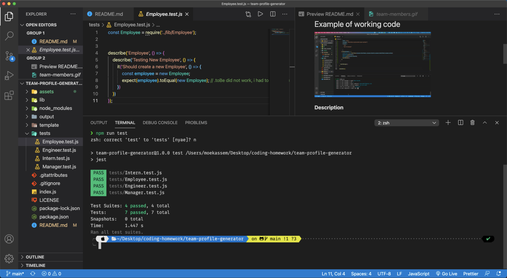
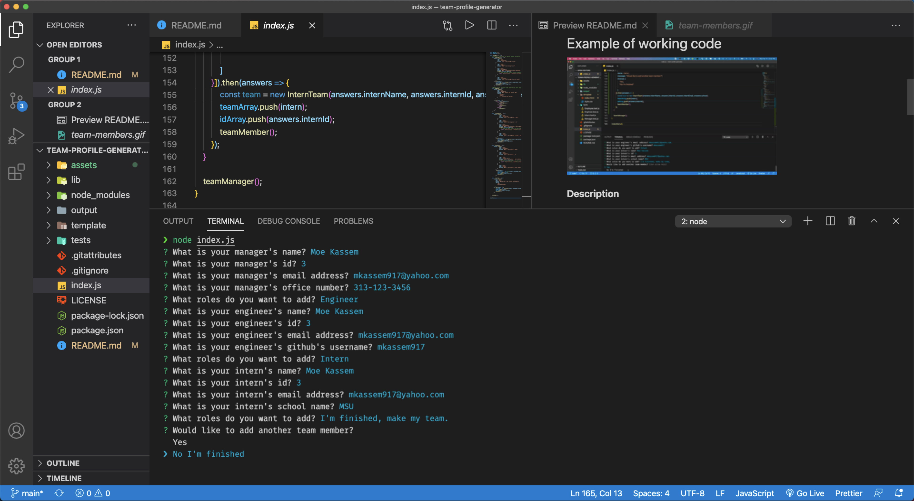
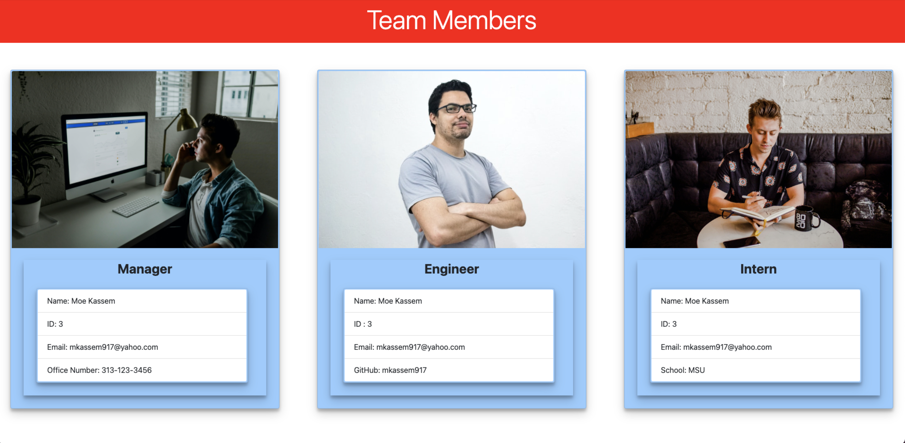

# team-profile-generator
 Week 10 Homework

  ## License
  

Link:  https://mkassem917.github.io/team-profile-generator/ 

Video: https://drive.google.com/file/d/1Y4OUD71iKvfquBnKowbqrs23rPHju_Vu/view 

## Example of working code

**Description**

The Team Profile Generator is running a node.js command line application that requests information from the user.

 Before running the application the user must perform an npm install to install all required dependencies.

 Node.js to create scripts that will output to an HTML file of Team Members
 

**All criteria has been met from the homework README.md file**

**Contents:**

* index.html
* index.js
* Lib, output, template, tests folders
* License
* assets  folder - Contains screenshots & gif
* README.md

**Tools Used:**

* w3schools website - help with .js code
* MDN website - help with .js code
* Stackoverflow
* npm.js
* nodejs.org
* https://unsplash.com/s/photos/ - for stock images

  
  
  
  
  
  
  

  

